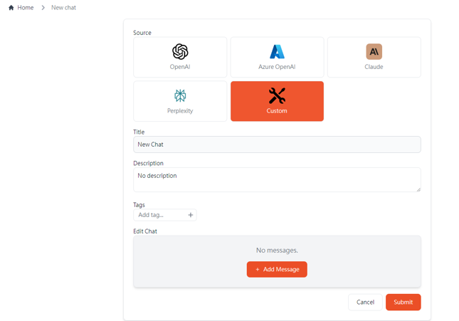
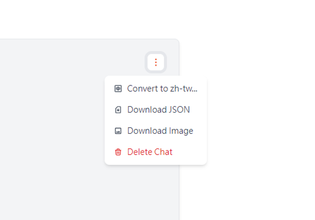
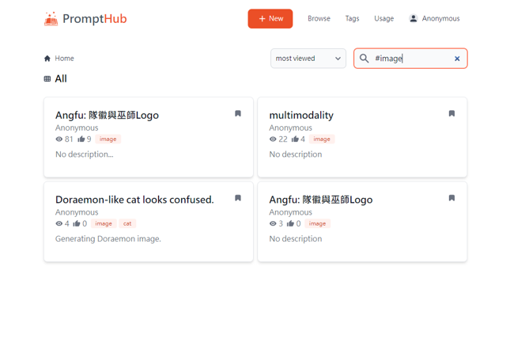

# PromptHub

PromptHub is a self-hosted prompt sharing platform that consolidates prompt experiences from various projects, allowing prompt beginners with similar needs to reference others' approaches.

For a more detailed introduction, check out our [Medium article](https://medium.com/@sinopac_dtd/prompthub-%E6%89%93%E9%80%A0%E6%B8%85%E6%96%B0-%E9%96%8B%E6%BA%90-%E5%90%88%E8%A6%8F%E7%9A%84%E7%A4%BE%E7%BE%A4%E7%B6%B2%E7%AB%99-a59f666fce8c).

<div align=center></div>

### With PromptHub, you can:

<table>
  <thead>
    <tr>
      <th>Upload</th>
      <th>Export</th>
      <th>Search</th>
    </tr>
  </thead>
  <tbody>
    <tr>
      <td>
        Upload the results of prompts, currently supporting OpenAI (ChatGPT web), Perplexity, and Claude.
      </td>
      <td>
        Convert the prompt results into Traditional Chinese and export them as images.
      </td>
      <td>
        Search for related prompts using tags or titles.
      </td>
    </tr>
    <tr>
      <td>
        
      </td>
      <td>
        
      </td>
      <td>
        
      </td>
    </tr>
  </tbody>
</table>

## Usage

### Deploy with Docker

```bash
docker build -t prompthub .
```

```bash
docker run -p 3000:3000 -v ./db:/app/db prompthub
```

Your should now be able to access PromptHub on `http://localhost:3000`.

### Data Migration

The DB schema of the newest version may not match older versions. Try running the auto migration script:

```bash
python db_utils/migrate.py {DB path}
```

### Merge sqlite DBs

Merge data of 2 sqlite DBs together.

- This script will overwrite `--to-db`, backup your files before running.
- If the columns of the 2 DBs don't match, only the common columns will be updated.

```bash
python db_utils/merge.py --from-db {source DB} --to-db {target DB} --table-name {table name}
```

## Join Our Team

[Turing Plan](https://www.sinopac.com/upload/event/turingplan/index.html)

## Contribution

Thank you for considering contributing to **PromptHub**! 🎉  
We welcome all contributions, whether it's fixing bugs, adding new features, or improving documentation. This guide will help you get started.

Please check out our [Contributing Guidelines](CONTRIBUTING.md) to get started.
